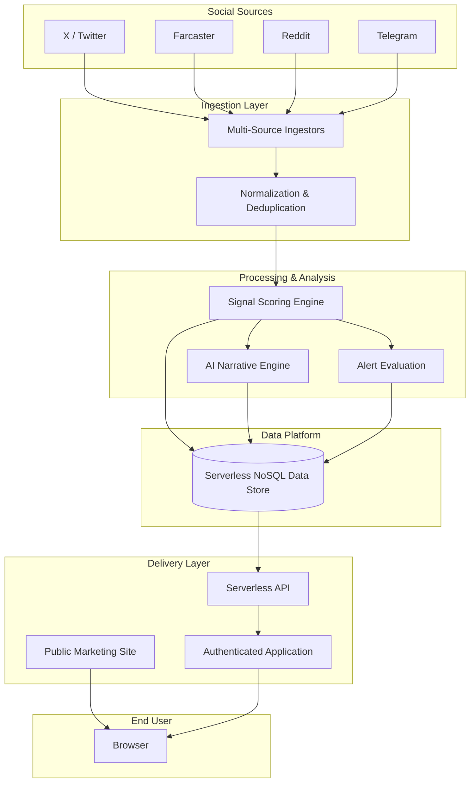
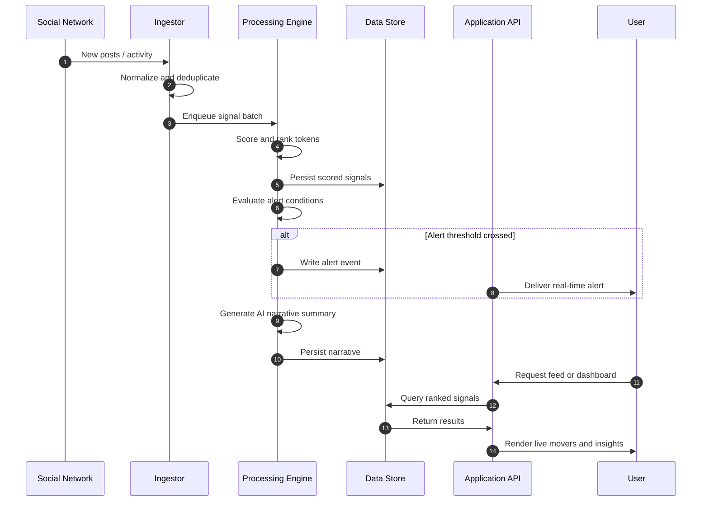

# Token Buzz

### Real-time crypto social intelligence.

*Surfaces the tokens the internet is talking about right now — social signal, narratives, and alerts across X, Farcaster, Reddit, and Telegram.*

---

---

## 🌱 Origins — From Java/ECS to Serverless

Token Buzz began life as a very different application. Its original incarnation was written in **Java** and lived at **[gitlab.com/fintechmetrix](https://gitlab.com/fintechmetrix)**, running on **AWS ECS** — a fleet of long-running, always-on containers that had to be provisioned, orchestrated, patched, and paid for around the clock regardless of how much traffic they actually served.

This codebase is a ground-up re-platforming of that project. Rather than port the Java stack container-for-container, it was **re-architected into a completely serverless TypeScript / Next.js application on AWS** — trading the always-on container model for on-demand functions, an on-demand database, and a global edge network, all defined as infrastructure-as-code and shipped through CI/CD.

The payoff is a dramatically **leaner, cost-optimized platform**. There are no idle containers burning money between requests: compute runs on **AWS Lambda** and scales to zero when nothing is happening, then scales out elastically under load with no capacity planning. State lives in **on-demand DynamoDB** (a single-table design) that charges per request rather than per provisioned node, and **CloudFront** serves the apps from the global edge. Eliminating container orchestration, host patching, and standing capacity collapses both the operational overhead and the total cost of ownership — you pay only for actual usage.

| | Before — Java on ECS | After — Serverless Next.js |
|---|---|---|
| **Language / runtime** | Java | TypeScript / Next.js |
| **Compute** | Always-on ECS containers | AWS Lambda functions |
| **Scaling** | Manual / provisioned capacity | Automatic, elastic, scale-to-zero |
| **Database** | Provisioned | On-demand DynamoDB (single-table) |
| **Delivery** | Container service | CloudFront global CDN |
| **Infra & deploy** | Container orchestration | SST infrastructure-as-code + CI/CD |
| **Cost model** | Pay for idle, always-on capacity | Pay-per-use, no idle cost |
| **Ops overhead** | Patching, orchestration, capacity planning | Fully managed, minimal maintenance |

---

## Overview

Token Buzz is a real-time SaaS platform for crypto intelligence. It continuously monitors social activity across the web's most influential crypto communities, extracts signal from the noise, and delivers it through a fast, polished application — so traders, researchers, and analysts always know what narratives are forming before they fully break.

The platform combines a public marketing presence with a fully authenticated application, backed by a serverless cloud infrastructure built for scale and low latency.

---

## ✨ Features

- **📡 Live Movers Feed** — A real-time stream of tokens gaining social traction, ranked and refreshed continuously across all monitored sources.
- **🔍 Multi-Source Social Ingestion** — Aggregates signal from X (Twitter), Farcaster, Reddit, and Telegram in a unified view.
- **📊 Analytics & Charts** — Price candlestick charts, volume overlays, and trend analytics for any tracked token.
- **🗂️ Watchlists & Dashboards** — Fully customizable watchlists and dashboard layouts so every user sees what matters to them.
- **🤖 AI-Generated Narratives** — A daily AI-produced brief that distills the biggest stories, emerging narratives, and community sentiment shifts.
- **🔔 Real-Time Alerts** — Configurable alerts triggered by social spikes, sentiment shifts, and momentum events — delivered the moment they happen.
- **🕑 Query History** — Persistent, searchable history of past signals and queries for research and backtesting.
- **👤 Account & Billing** — Self-serve subscription management, plan upgrades, and account settings powered by a world-class payments infrastructure.

---

## 📚 Documentation

Full product, security, and developer documentation lives on GitBook:

**➡️ [runtimedesigns.gitbook.io/token-buzz](https://runtimedesigns.gitbook.io/token-buzz/)**

| Section | What's inside |
|---|---|
| **Getting Started** | Product overview, quickstart, and account & billing. |
| **Product Guide** | Every feature — Movers, Live Feed, Alerts, Watchlists & Dashboards, Analytics, Hum AI, Charts, Query History, and the command palette. |
| **Connecting Data** | How to bring your own data sources. |
| **Security & Compliance** | Security posture, data handling & encryption, and the shared-responsibility model. |
| **Developers / API** | API surfaces and authentication. |

---

## 🏗️ Architecture

### System Overview

A high-level view of how data flows from raw social activity through to the end user.

### Signal-to-Insight Flow

A sequence view of how a social spike becomes a delivered alert or narrative.

---

## 🧰 Tech Stack

| Layer | Technologies |
|---|---|
| **Frontend** | Next.js · React · TypeScript · Tailwind CSS |
| **Backend** | Serverless functions on AWS · TypeScript |
| **Infrastructure** | AWS (fully serverless) · Infrastructure-as-Code · Global CDN |
| **Data** | DynamoDB (single-table design) · Real-time event processing |
| **Auth** | Clerk |
| **Billing** | Stripe |
| **AI** | Large language model summaries and narrative generation |
| **Social Ingestion** | Multi-source adapters — X, Farcaster, Reddit, Telegram |

---

## 📈 Status

> **Actively developed. Continuously shipping.**

Token Buzz is in production and serving live users. The platform is under active development, with new signal sources, analytics features, and AI capabilities rolling out on an ongoing basis.

---

© 2026 Token Buzz. All rights reserved.

This is **proprietary software**. Unauthorized copying, distribution, modification, or use is strictly prohibited.

*This is a private repository. Access is by invitation only.*

