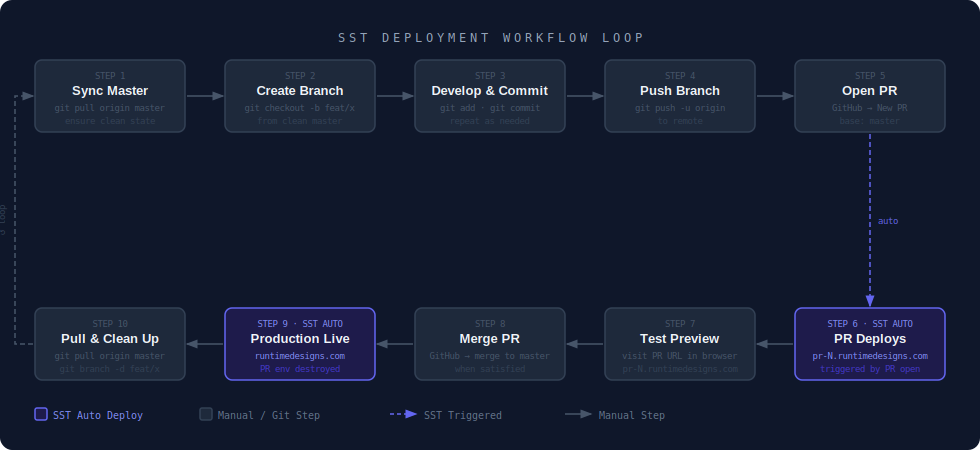

# SST Deployment Process

This document covers the end-to-end setup and daily development workflow for this project. It is intended to be followed in order when setting up from scratch, and referenced for the ongoing development loop.

---

## Table of Contents

1. [Creating the SST Workspace](#1-creating-the-sst-workspace)
2. [Connecting AWS via CloudFormation](#2-connecting-aws-via-cloudformation)
3. [Connecting the GitHub Repository](#3-connecting-the-github-repository)
4. [Setting Secrets](#4-setting-secrets)
5. [Initial Deploy to Production](#5-initial-deploy-to-production)
6. [Development Workflow](#6-development-workflow)
7. [Workflow Diagram](#7-workflow-diagram)

---

## 1. Creating the SST Workspace

The SST Console is the dashboard that manages autodeploys, environments, and secrets.

1. Go to [console.sst.dev](https://console.sst.dev) and sign in with GitHub.
2. Create a new **Workspace**. Name it after your organization (e.g. `runtimedesigns`).
3. A workspace maps to a single GitHub organization. If you manage multiple orgs, create a separate workspace for each.

---

## 2. Connecting AWS via CloudFormation

The SST Console deploys into your own AWS account. It needs an IAM role to do so, which is installed via a CloudFormation stack.

1. In the SST Console, go to **Workspace Settings → AWS Accounts → Add Account**.
2. SST generates a CloudFormation template URL. Click it to open directly in the AWS Console.
3. Make sure you are in the **`us-east-1`** region before deploying the stack (this project deploys to `us-east-1`).
4. Deploy the CloudFormation stack. It creates an IAM role that SST Console assumes for deployments.
5. Return to the SST Console — the account will appear as connected once the stack completes.

---

## 3. Connecting the GitHub Repository

1. In the SST Console, go to **Workspace Settings → Integrations → Connect GitHub**.
2. Install the **SST GitHub App** on the `runtimedesigns` organization and grant it access to the `website-v2` repository.
3. In the SST Console, open the `website-v2` app → **Settings → Autodeploy**.
4. Select the `runtimedesigns/website-v2` repository.
5. Configure two **Environments**:

   | Environment | Stage Pattern | AWS Account    | Env Vars              |
   |-------------|---------------|----------------|-----------------------|
   | `production`| `production`  | 836651842362   | `CLOUDFLARE_API_TOKEN`|
   | `pr-*`      | `pr-*`        | 836651842362   | `CLOUDFLARE_API_TOKEN`|

   The `CLOUDFLARE_API_TOKEN` must be set in **both** environments. PR stages need it to create DNS records for `pr-N.runtimedesigns.com`.

> The autodeploy trigger logic lives in `sst.config.ts` — the Console environments only provide the AWS account and runner environment variables.

---

## 4. Setting Secrets

SST secrets are stored in AWS SSM Parameter Store. They must be set in two passes: once for production (explicit stage) and once as a fallback for all PR stages.

### Production Secrets

These apply only to the `production` stage:

```bash
npx sst secret set DOMAIN runtimedesigns.com --stage production
npx sst secret set RESEND_API_KEY <value> --stage production
npx sst secret set CONTACT_FROM_ADDRESS <value> --stage production
npx sst secret set CONTACT_TO_ADDRESS <value> --stage production
npx sst secret set NEXT_PUBLIC_SANITY_PROJECT_ID <value> --stage production
npx sst secret set NEXT_PUBLIC_SANITY_DATASET <value> --stage production
npx sst secret set SANITY_API_READ_TOKEN <value> --stage production
npx sst secret set NEXT_PUBLIC_TURNSTILE_SITE_KEY <value> --stage production
npx sst secret set TURNSTILE_SECRET <value> --stage production
```

### Fallback Secrets

These are used by any stage that does not have an explicit value set — this covers all PR stages (`pr-1`, `pr-2`, etc.). The `DOMAIN` fallback is the base domain; PR stages automatically prepend the stage name (e.g. `pr-1.runtimedesigns.com`).

```bash
npx sst secret set DOMAIN runtimedesigns.com --fallback
npx sst secret set RESEND_API_KEY <value> --fallback
npx sst secret set CONTACT_FROM_ADDRESS <value> --fallback
npx sst secret set CONTACT_TO_ADDRESS <value> --fallback
npx sst secret set NEXT_PUBLIC_SANITY_PROJECT_ID <value> --fallback
npx sst secret set NEXT_PUBLIC_SANITY_DATASET <value> --fallback
npx sst secret set SANITY_API_READ_TOKEN <value> --fallback
npx sst secret set NEXT_PUBLIC_TURNSTILE_SITE_KEY <value> --fallback
npx sst secret set TURNSTILE_SECRET <value> --fallback
```

To verify:

```bash
npx sst secret list                    # shows fallback secrets
npx sst secret list --stage production # shows production secrets
```

---

## 5. Initial Deploy to Production

Run this once from your local machine to create the production infrastructure for the first time. All subsequent deploys happen automatically via SST Console when you push to `master`.

```bash
npx sst deploy --stage production
```

This provisions:
- CloudFront distribution
- Lambda functions (server, image optimizer, revalidation)
- S3 bucket for static assets
- ACM certificate (DNS validated via Cloudflare)
- Cloudflare DNS records pointing to CloudFront

The deploy output will print the production URL:

```
WebUrl: https://runtimedesigns.com
```

---

## 6. Development Workflow

The development loop is designed so that `master` always reflects what is live in production. No changes are ever committed directly to `master`.

### Step 1 — Sync Master

Before starting any work, make sure your local `master` is clean and up to date with the remote.

```bash
git checkout master
git pull origin master
```

Confirm there are no uncommitted changes before proceeding.

### Step 2 — Create a Feature Branch

Create a new branch from master for your changes:

```bash
git checkout -b feat/your-feature-name
```

Use a descriptive name. The branch name does not affect the deployment URL (all PRs deploy to `pr-N.runtimedesigns.com` regardless of branch name).

### Step 3 — Develop and Commit

Make your changes and commit them to the branch. Repeat as many times as needed:

```bash
git add <files>
git commit -m "describe what changed"
```

### Step 4 — Push the Branch

Push your branch to the remote:

```bash
git push -u origin feat/your-feature-name
```

### Step 5 — Open a Pull Request

Go to [github.com/runtimedesigns/website-v2](https://github.com/runtimedesigns/website-v2). GitHub will show a banner prompting you to open a PR for your recently pushed branch. Click **Compare & pull request**, set the base to `master`, fill in the title and description, and click **Create pull request**.

Alternatively, use the CLI:

```bash
gh pr create --base master --title "Your title" --body "Description"
```

### Step 6 — SST Deploys PR Preview (Automatic)

Once the PR is opened, the SST Console receives the event and automatically deploys a preview environment. You can monitor progress in the SST Console under the **Autodeploy** tab.

The preview URL will be:

```
https://pr-N.runtimedesigns.com
```

where `N` is the PR number assigned by GitHub.

### Step 7 — Test the Preview

Open the PR URL in a browser and verify the changes work as expected. If you need to make further changes, commit and push to the branch again — SST will redeploy the preview automatically on each push.

### Step 8 — Merge the PR

When satisfied with the preview, merge the PR into `master` on GitHub.

### Step 9 — SST Deploys Production and Destroys PR Environment (Automatic)

Merging triggers two simultaneous automated pipelines in SST Console:

- **Production deploy** — pushes changes to `runtimedesigns.com`
- **PR environment teardown** — runs `sst remove` on the `pr-N` stage, destroying the preview CloudFront distribution, DNS record, and Lambda functions

### Step 10 — Pull Master and Delete the Branch

Bring your local `master` up to date and remove the feature branch:

```bash
git checkout master
git pull origin master
git branch -d feat/your-feature-name
git push origin --delete feat/your-feature-name
```

You are now back at Step 1 with a clean, synced master. The loop is complete.

---

## 7. Workflow Diagram



> Purple boxes (Steps 6 and 9) are fully automated — they require no action from you. The dashed lines indicate SST Console-triggered pipelines fired by GitHub events.
